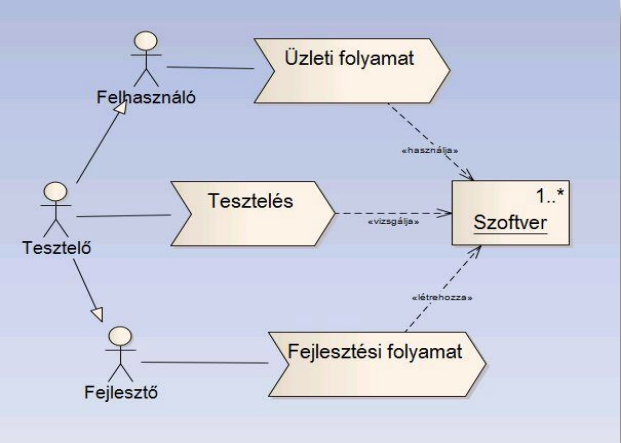

<h1 align="center">Szoftverfejlesztési módszertanok</h1>
<h4 align="center">Webáruház</h1>

## Tartalom

1. **Tartalom**

2. **Követelmények**

    1. Funkcionális követelmények

    2. Jogi követelmények

3. **Fejlesztői dokumentáció**

    1. Feladat 

    2. Környezet 

    3. Tervezés 

    4. Megvalósítás menete 

    5. Tesztelés

    6. Fejlesztési lehetőségek

    7. Verzió kezelés

4. **Szerzők** 

<h2 align="center">Követelmények</h1>

**Funkcionális követelmények:**

| Kötelezően teljesítendő követelmények |	A tesztelés módszere |
  :-----------------------------------:    :--------------------:
| 1.	Termék, szolgáltatás információk |	A funkcionális követelményben meghatározott feltételek meglétének ellenőrzése legalább 10 cikk vagy valamennyi termék (11 termék alatti portfoliónál) esetében. Az áruház feltöltöttségének ellenőrzése, oly módon, hogy a cég alap, eladásra szánt áru- és szolgáltatás készlete megtalálható a webáruház felületén megrendelhető tételként. |
|Célja a termékek/szolgáltatások ismertségének növelése, a kereslet fokozása. A cég termék/ szolgáltatás portfóliójának részletes ismertetése legalább az alábbi információk megadásával:|	
| •	a termék/szolgáltatás megnevezése; 	|
| •	a termék/szolgáltatás lényegi leírása, bemutatása	|
| •	a  termék  vagy  a  termékhez  szorosan  köthető  kép  megjelenítése	|
| •	a termék/szolgáltatás kategóriája a cég által használt csoportosítás szerint;	|
| •	a termék/szolgáltatás műszaki paraméterei, vagy fel-használási feltételei	|
| •	a termék/szolgáltatás ára/díjazása, kedvezmények; 	|

| Kötelezően teljesítendő követelmények  | A tesztelés módszere |
| ------------- | ------------- |
| 1.	Termék, szolgáltatás információk  | A funkcionális követelményben meghatározott feltételek meglétének ellenőrzése legalább 10 cikk vagy valamennyi termék (11 termék alatti portfoliónál) esetében. Az áruház feltöltöttségének ellenőrzése, oly módon, hogy a cég alap, eladásra szánt áru- és szolgáltatás készlete megtalálható a webáruház felületén megrendelhető tételként.  |
| Content Cell  | Content Cell  |
| Content Cell  | Content Cell  |
| Content Cell  | Content Cell  |
| Content Cell  | Content Cell  |
| Content Cell  | Content Cell  |
| Content Cell  | Content Cell  |
| Content Cell  | Content Cell  |

**Jogi követelmények:**

Az elsődleges feltétel a számlaképesség és tevékenységi kör felvétele. Habár engedélyt nem igényel egy webshop elindítása, de számlaképességhez szükséges egy vállalkozási forma megléte.

Miután megalapítottuk a vállalkozásunkat, a következő lépés, hogy jegyeztessük be a „4791 – Csomagküldő, internetes kiskereskedelem" tevékenységi kört, melyben a könyvelőnk fog tudni segíteni.  Továbbá a webshopot indító köteles a kereskedelmi tevékenységét bejelenteni a székhelye szerinti jegyzőnél.

A webshopok tájékoztatási követelményei tekintetében az egyik legfontosabb a fogyasztó és a vállalkozás közötti szerződések részletes szabályairól szóló 45/2014. (II. 26.) Korm. rendelet, melynek 11. §-a meghatározza, hogy a webáruház felületén miről vagyunk kötelesek előzetesen, tehát a szerződés megkötését megelőzően tájékoztatnunk a fogyasztót.

A szolgáltató webshop tulajdonos az igénybe vevő megrendelésének elküldését megelőzően köteles egyértelműen tájékoztatni az igénybe vevőt a részletekről.

A webshopban történő értékesítés során személyes adatokat kezelünk, tehát adatkezelővé válunk. Az adatkezelőnek pedig minden adatkezelési körülményről átlátható tájékoztatást kell adnia megfelelve a GDPR szabályainak.

<h2 align="center">Fejlesztői dokumentáció</h1>

**Feladat:**

Egy webáruházat tervezünk, amelyen termékeket fogunk eladni. A rendszer üzemeltetője szabadon tölthet fel termékeket egy webadminon keresztül amely a vásárlók számára bejelentkezés után előrhetővé válik. Tervünk egy olyan webshop megvalósítása amely mind a funkcionális, mind a jogi követelményeknek megfelelően üzemeltethető és a teljesség hiánya nélkül kielégíti a vásárlókat, üzemeltetőket. A fejlesztési folyamatok során törekszünk a „clean code" elvek integrálására valamint a minnél gyorsabb és egyszerűbb megvalósítására.

**Környezet:**

Linux/Windows 10, Php Laravel keretrendszer, bootstrap, javascript, scss, html

**Tervezés:**

A projektünket a Trello nevű alkalmazással terveztük, ami átláthatóságot, egyszerűséget biztosít és a csapatban dolgozást lényegesen megkönnyebbíti.

**Megvalósítás menete:**

A tervezési folyamatokat követően a fejlesztést verziókezelő segítségével megkezdjük.
 A fejlesztési folyamatokat több ágra osztjuk a fejlesztők között majd az egyes ágak elkészültével mergeljük azokat.
 A fejlesztés előrehaladtával folyamatos moduláris teszteket futtatunk, mely elősegíti az esetleges hibák felfedezését.

**Tesztelés:**

Fehérdobozos (white-box) vagy strukturális teszt, amikor a forráskód alapján készülnek a tesztesetek. Webshopunk fejlesztése folyamán ezt a tesztelési módszert fogjuk követni. A tesztelést strukturális módon végezzük mivel már meglévő kódokat, forráskódokat tesztelünk.

A strukturális teszt esetén értelmezhető a (struktúra) lefedettség. A lefedettség azt mutatja meg, hogy a struktúra hány százalékát tudjuk tesztelni a meglévő tesztesetekkel. Általában ezeket a struktúrákat teszteljük:

• kódsorok,

• elágazások,

• metódusok,

• osztályok,

• funkciók,

• modulok.

A forráskódok tesztelése közben a projekt folyamatos haladásával egyidejűleg rendszerteszteket is végzünk. A rendszerteszt a már kész szoftverterméket teszteli, hogy megfelel-e:

• a követelmény specifikációnak,

• a funkcionális specifikációnak,

• a rendszertervnek.

A tesztek után meg kell vizsgálni, hogy sikeresen teljesítettük-e a kilépési feltételt. Ehhez a tesztesetben leírt elvárt eredményt hasonlítjuk össze a teszt naplóban lévő valós eredménnyel a kilépési feltétel alapján. Amennyiben releváns eredményeket kapunk a tesztelési folyamatok végén a tesztelést lezárhatjuk és a későbbi tapasztalatok, a program valós futása közben, adhatnak még további eredményeket.

**Fejlesztési lehetőségek:**

Az üzleti teendők automatizálása kulcsfontosságú a hatékony ügyvitel szempontjából. Az egyik ilyen tennivaló a számlázás, ami még akkor is időigényes, ha online számlázunk, amennyiben ezt emberi beavatkozással, kézzel csináljuk. Ennek kiküszöbölésére nyújt kézenfekvő megoldást a [Számla Agent API](https://docs.szamlazz.hu/#introduction) azáltal, hogy direkt hozzáférést biztosít az adatokhoz külső szoftvereknek, például webshopmotoroknak vagy digitális ügyviteli rendszereknek. Ehhez felhasználható a szamlazz.hu api-a.
 Online fizetés, bankkártyás fizetés létrehozása.
 Legvégső fejlesztési lehetőség a webshop kiadása éles szerveren való üzemeltetése.

**Verziókezelés:**

A verziókezelői tevékenységek végrehajtására a Git nyílt forráskódú, elosztott verziókezelő szoftvert használjuk

<h2 align="center">Szerzők</h1>

* **Merk Dóra**
* **Novák Dániel**
* **Tomasovszki Adrián**

<h2 align="center">Hivatkozások</h1>

[Funkcionális követelmények](https://adoc.pub/9-sz-melleklet-internetes-ertekesites-vallalati-webaruhaz-fu.html)

<h2 align="center">Verziók</h1>

* **Laravel** (v9.31.0)
* **Php** (v8.0.11)
* **Docker** (v20.10.7)
* **Npm** (v7.24.1)
* **NodeJS** (v16.17.1)
